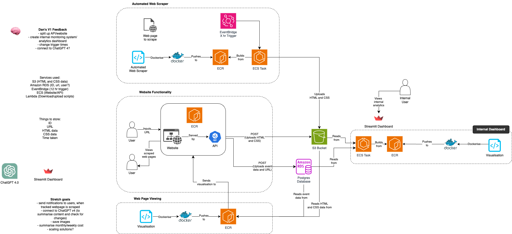
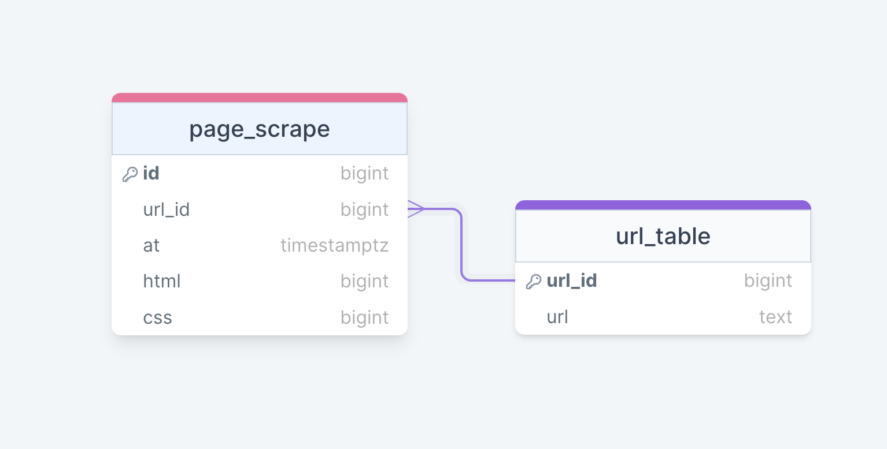

# Internet Archiver
For this project, a website was created which can take inputs of website urls and scrape those pages. This data is then stored and can be redisplayed on the website when requested. A dashboard of the most popular websites to archive and other data was created. Each website is scraped again after 3 hours and all past versions are visible.

## Setup and Installation
For some folders there will be a `requirements.txt` file. Once in the folder, you can run the following command:
- `pip3 install -r requirements.txt`

A `.env` is required in every folder containing:
-DB_NAME
-DB_IP
-DB_PORT
-DB_USERNAME
-DB_PASSWORD
-AWS_ACCESS_KEY_ID
-AWS_SECRET_ACCESS_KEY
-S3_BUCKET

A `terraform.tfvars` is required in the terraform folder containing:
-S3_BUCKET
-DB_IP
-DB_PORT
-DB_NAME
-DB_USERNAME
-DB_PASSWORD
-AWS_ACCESS_KEY_ID
-AWS_SECRET_ACCESS_KEY
-URL_TABLE_NAME
-SCRAPE_TABLE_NAME
-AWS_GROUP
-AWS_REGION
-AWS_STREAM_PREFIX

## Files
### Api Folder
-`app.py`: A python script containing the main application, which makes the internet archiver website.
-`download_from_s3.py`: A python script which downloads css and html files from an s3 bucket.
-`upload_to_s3.py`: A python script which uploads css and html files to an s3 bucket.
-`extract_from_database.py`: A python script which extracts url data from a database.
-`upload_to_database.py`: A python script which uploads url data from a database.
-`requirements.txt`: A text file containing the required python libraries to run the website.

### Database Folder
-`schema.sql`: An SQL script that creates all the tables in the database.
-`reset_schema.sh`: A bash script that runs `schema.sql` to produce the tables.
-`login.sh`: A bash script that logs into the database for debugging purposes.

### Terraform Folder
-`main.tf`: A terraform script that creates the project architecture in AWS.
-`variable.tf`: A terraform script containing the necessary variables for `main.tf`.

### WebScraper Folder
-`extract.py`: A python script that extracts url data from the database.
-`load.py`: A python script used to insert the re-scraped HTML and CSS files into the S3 bucket.
-`pipeline.py`: A python script that web scrapes the non-duplicate URLs contained in the S3 bucket.
-`test_extract.py`: A python script containing unit tests for the extract.py file.
-`Dockerfile`: A docker file used to collate the pipeline into an image.
-`requirements.txt`: A text file containing the required python libraries to run the pipeline.

## Architecture Diagram

## ERD Diagram
